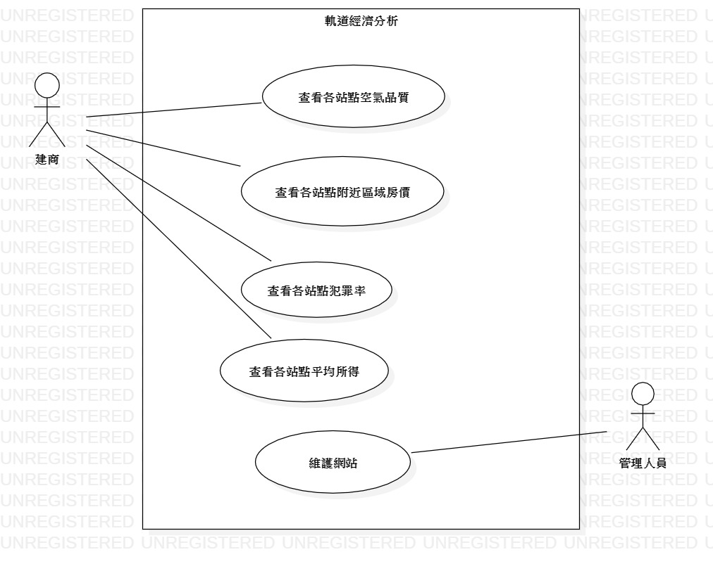
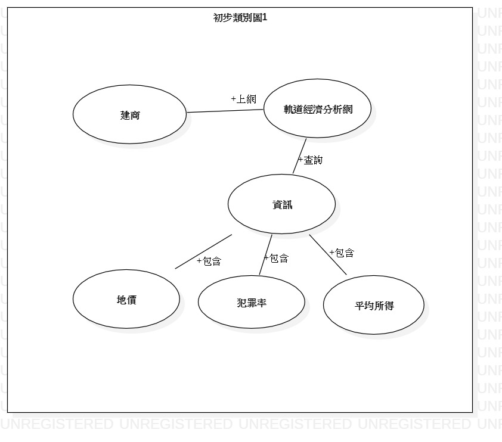
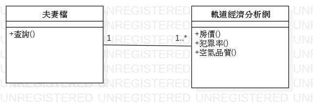
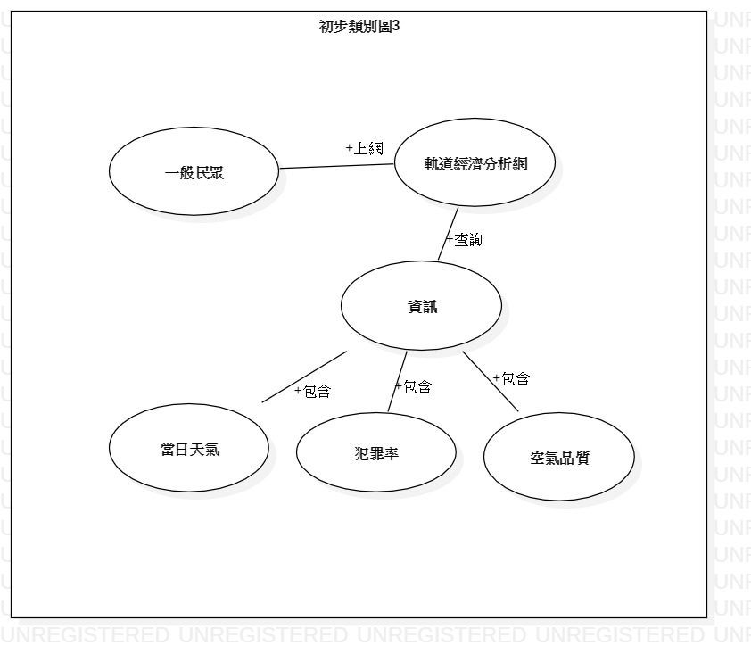

# 包惠如

## 學號:0624095

### 資管系 三甲

#### 專題名稱:軌道經濟分析

##### 小組成員:
```
* 0624089 李宜峰(組長)
* 0624045 王品捷
* 0624095 包惠如
```

### 需求清單
```
 1.高雄捷運路線地圖
 2.各站點周邊區域資訊:空氣品質、房價、犯罪率、平均所得......
```
### 功能性需求
```
查看各站點周邊區域資訊
```
### 非功能性需求
```
1.系統會每日更新各站點空氣品質的資訊
2.系統能在10秒內顯示出使用者所點選的資訊
```
### 使用案例
```
使用案例1
主要路徑
1.建商計畫在高雄建屋
2.上軌道經濟網查詢資訊
4.網站提供站點附近房價、地價
5.網站提供各站點犯罪率
6.網站提供各站點平均所得
7.評估後建商決定在左營建屋
```
```
使用案例2
主要路徑
1.夫妻檔要在高雄買房
2.上軌道經濟網查詢資訊
3.網站提供各站點空氣品質
4.網站提供站點附近房價
5.網站提供各站點犯罪率
6.網站提供各站點平均所得
7.評估後夫妻檔決定在西子灣購屋
```
```
使用案例3
主要路徑
1.遊客想去美麗島站附近遊玩
2.上軌道經濟網查詢資訊
3.網站提供各站點空氣品質
4.網站提供站點天氣資訊
5.查詢之後遊客決定取消行程，因為空氣品質不佳
```

### 使用案例圖



### 初步類別圖
初步類例圖1


初步類例圖2


初步類例圖3


[高科大](https://www.nkust.edu.tw/)

<https://webap.nkust.edu.tw/nkust/f_index.html>

| First | Second | Third |
| :---- | :----: | ----: |
|1 | 2 | 3  |
|1 | 2 | 3  |

:smile:

:heart:

:snowman:


[](https://www.youtube.com/watch?v=Kh5pPTTpji4)
