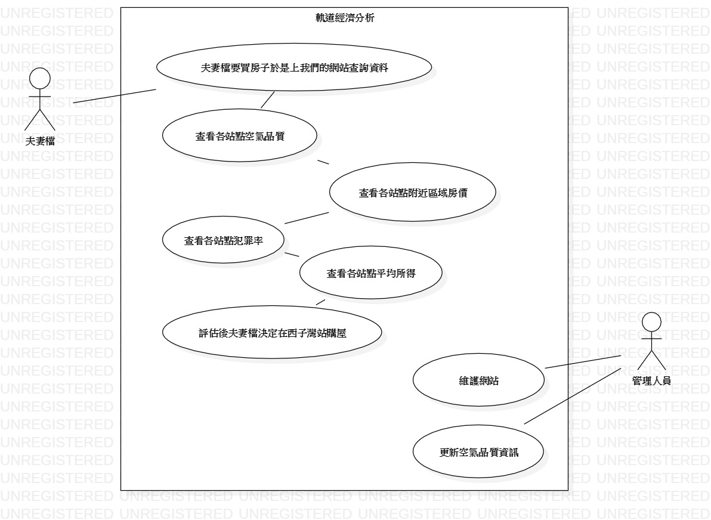

# 包惠如

## 學號:0624095

### 資管系 三甲

#### 專題名稱:軌道經濟分析

##### 小組成員:
```
* `0624089 李宜峰`
* 0624045 王品捷
* 0624095 包惠如
```

## 需求清單
```
 1.高雄捷運路線地圖
 2.各站點周邊區域資訊:空氣品質、房價、犯罪率、平均所得......
```
## 功能性需求
```
查看各站點周邊區域資訊
```
## 非功能性需求
```
1.系統會每日更新各站點空氣品質的資訊
2.系統能在10秒內顯示出使用者所點選的資訊
```




[高科大](https://www.nkust.edu.tw/)

<https://webap.nkust.edu.tw/nkust/f_index.html>

| First | Second | Third |
| :---- | :----: | ----: |
|1 | 2 | 3  |
|1 | 2 | 3  |

:smile:

:heart:

:snowman:


[](https://www.youtube.com/watch?v=Kh5pPTTpji4)
