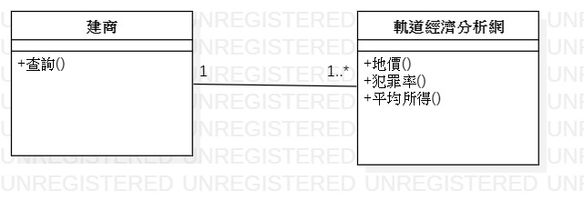
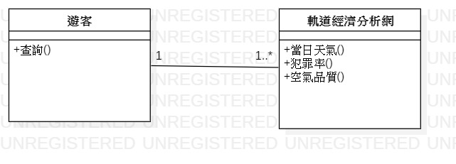
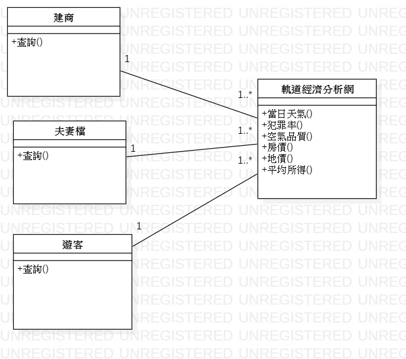
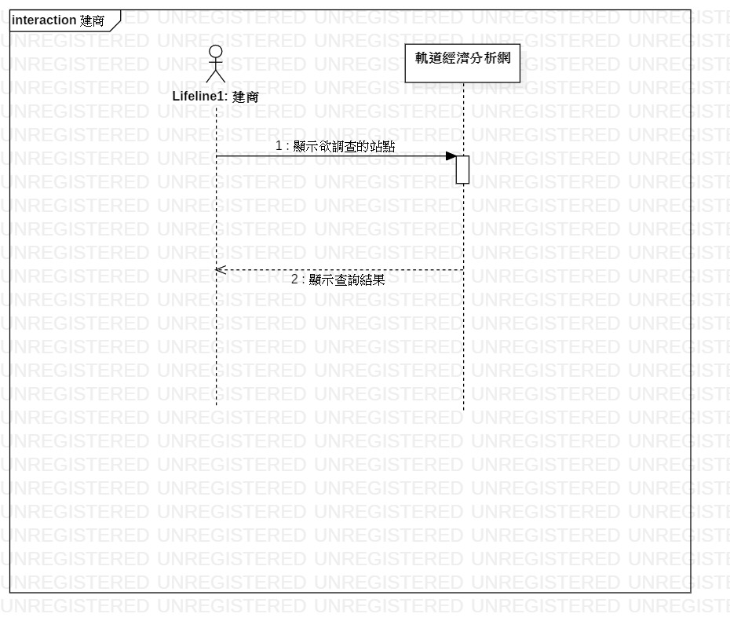
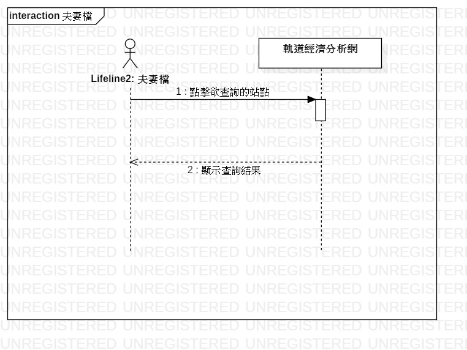
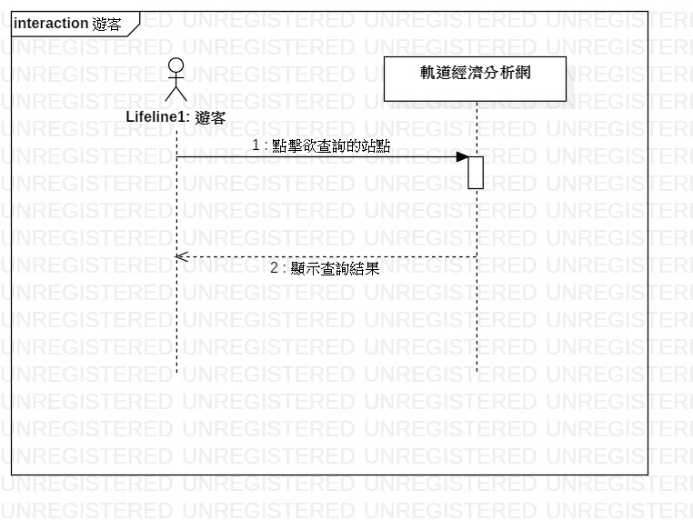
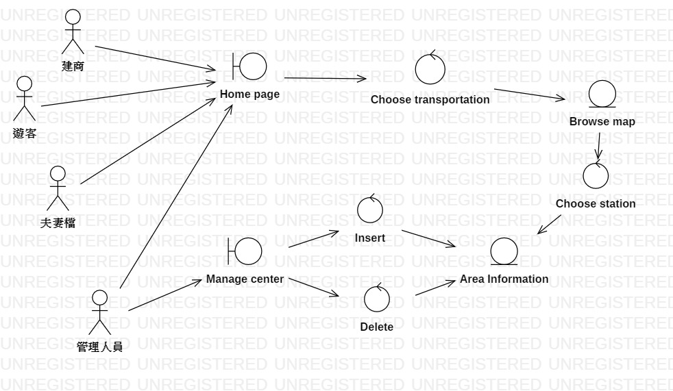

# 包惠如

## 學號:0624095

### 資管系 三甲

#### 專題名稱:軌道經濟分析

##### 小組成員:
```
* 0624089 李宜峰(組長)
* 0624045 王品捷
* 0624095 包惠如
```

### 需求清單
```
 1.高雄捷運路線地圖
 2.各站點周邊區域資訊:空氣品質、房價、犯罪率、平均所得......
```
### 功能性需求
```
查看各站點周邊區域資訊
```
### 非功能性需求
```
1.系統會每日更新各站點空氣品質的資訊
2.系統能在10秒內顯示出使用者所點選的資訊
```
### 使用案例
```
使用案例1
主要路徑
1.建商計畫在高雄建屋
2.上軌道經濟網查詢捷運站各站資訊
4.網站提供站點空氣品質、附近房價、犯罪率及平均所得
5.進行分析後建商決定在左營建屋
```
```
使用案例2
主要路徑
1.夫妻檔欲在高雄買房
2.上軌道經濟網查詢捷運站各站資訊
3.網站提供各站點空氣品質、附近房價、犯罪率及平均所得
4.評估後夫妻檔決定在西子灣購屋
```
```
使用案例3
主要路徑
1.遊客想去美麗島站附近遊玩
2.上軌道經濟網查詢美麗島站之資訊
3.網站提供站點空氣品質及天氣資訊
4.查詢之後遊客決定取消行程，因為空氣品質不佳
```

### 使用案例圖


### User Story
```
 1.身為一位建商，我希望能查看各站點空氣品質，以便我了解哪些站點空氣品質較好，較有可能吸引人居住。
 2.身為一位建商，我希望能查看各站點附近區域房價，以便我分析這個區域的房價應訂為多少較為合適。
 3.身為一位建商，我希望能查看各站點犯罪率，以便我了解哪些站點的治安較好，能讓人安心居住。
 4.身為一位建商，我希望能查看各站點平均所得，以便讓我了解各站點居民的經濟能力。
 5.身為一位管理人員，我希望能有一個維護網站的介面，以便我對網站內的資訊進行修改與確認。
```


### 初步類別圖
初步類別圖1


初步類別圖2


初步類別圖3


總和類別圖


### 系統循序
建商循序圖


夫妻檔循序圖


遊客循序圖


### 強韌圖


[高科大](https://www.nkust.edu.tw/)

<https://webap.nkust.edu.tw/nkust/f_index.html>

| First | Second | Third |
| :---- | :----: | ----: |
|1 | 2 | 3  |
|1 | 2 | 3  |

:smile:

:heart:

:snowman:


[](https://www.youtube.com/watch?v=Kh5pPTTpji4)
